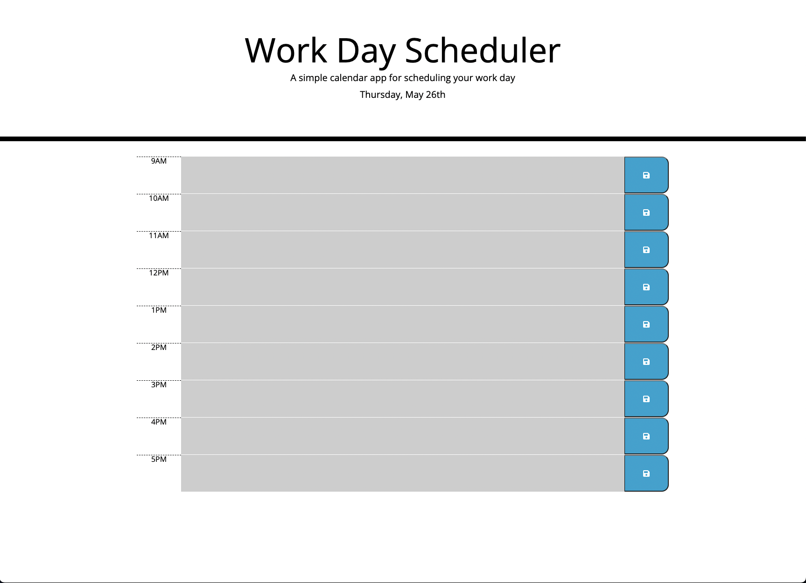

# Work Day Scheduler 

Simple calendar application that allows the user to save events for each hour of the day. This app will run in the browser and feature dynamically updated HTML and CSS powered by jQuery. Local storage was used to allow the input of the user to persist even when the browser has been opened and closed or refreshed. Moment.js was utilized to capture the current date and time information.

[Deployed Application Link](https://parinthalangdee.github.io/05-WorkDayScheduler/)

